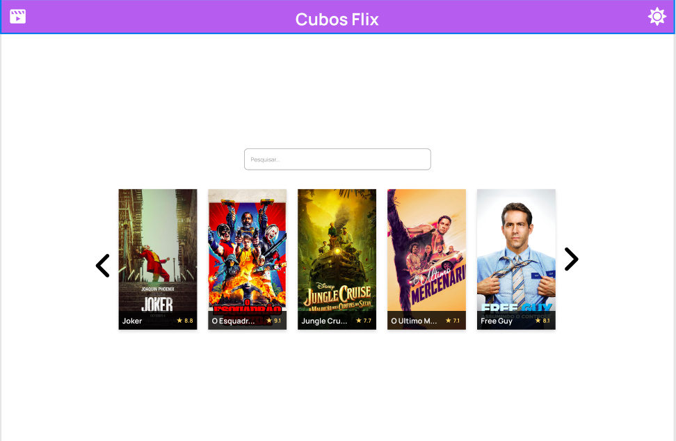
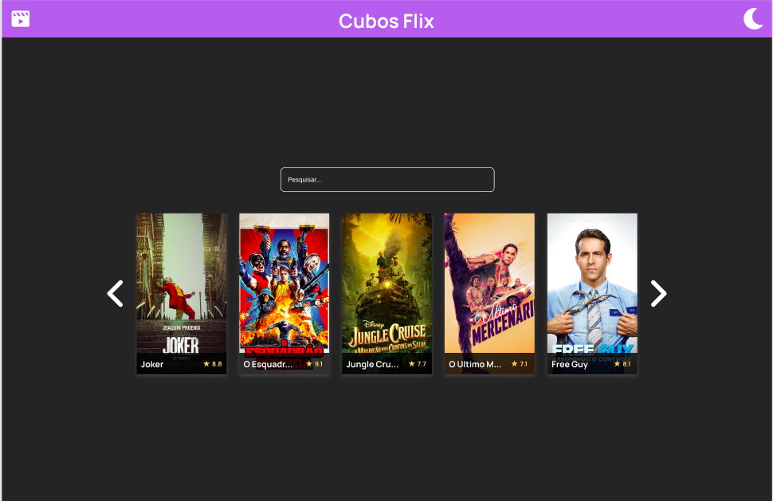
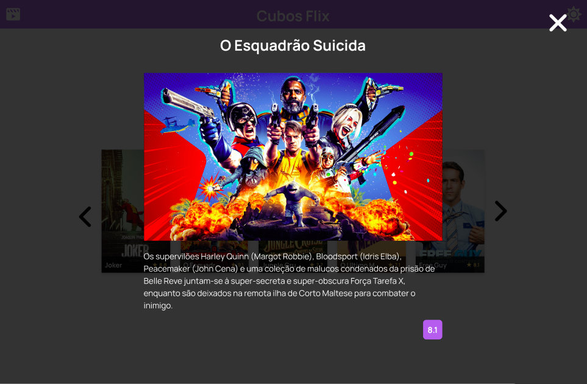

# Catálogo de Filmes

## Instruções

### backend

- Com o terminal apontado para dentro da pasta "backend", use o comando `npm i`
- Use o comando `npm dev` para rodar o projeto
- Instale a extensão "REST Client" caso deseje usar o arquivo "requisicao.http" como cliente http

## frontend

### Telas

#### Tela de Login

Crie uma tela de login simples com os campos nome e e-mail.

#### Tela principal

<figure>
  
  <figcaption>Tela inicial clara</figcaption>
</figure>

<figure>
  
  <figcaption>Tela inicial escura</figcaption>
</figure>

#### Modal de detalhamento de filmes

<figure>
  
  <figcaption>Modal de detalhe de um filme</figcaption>
</figure>

### Detalhes

Para maiores detalhes:

- Abra o Figma
- Use o arquivo .fig para visualizar o design do projeto

## Detalhamentos de Requisitos

### Página de login

- Crie uma página de login (o design não está feito) para autenticação do usuário
- Existe um arquivo chamado "backend/bancoDeDados.js" que será nosso mock do banco. Neste arquivo existem dados pré-cadastrados de usuários e filmes
- Deverá ser feita uma requisição `POST /login`
- Quando o login for realizado com sucesso, o usuário irá receber o token

### Visualização de filmes

- Assim que o website for aberto, a listagem de filmes deverá ser preenchida com as informações do endpoint `GET /filmes`

### Paginação de filmes

- Serão mostrados 5 filmes de cada vez
- Ao voltar ou avançar uma página, os filmes em tela serão atualizados corretamente

### Busca de filmes

- À medida que o usuário for digitando o nome de um filme, deve-se aplicar o filtro de acordo com o nome.

### Modal de filme

- Quando o usuário clicar em um filme, ele deve ser capaz de ver os detalhes dele. Os detalhes serão obtidos pelo endpoint `GET /filmes/:id`

### Mudança de tema

Ao clicar na imagem no canto superior direito, caso o tema atual seja "light" ("claro"), o mesmo deverá ser trocado para o tema "dark" ("escuro"). Após isso, você deverá modificar o tema (imagens e cores) do seu website de acordo com o Figma. Essa troca de tema, poderá ser facilitada caso seja feita por meio da troca de variáveis CSS.
